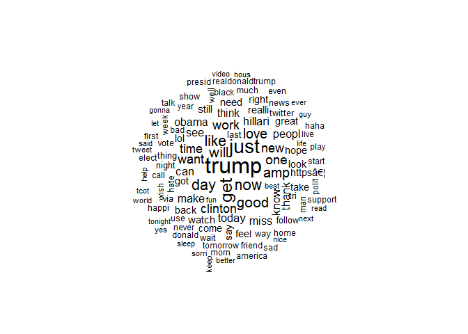
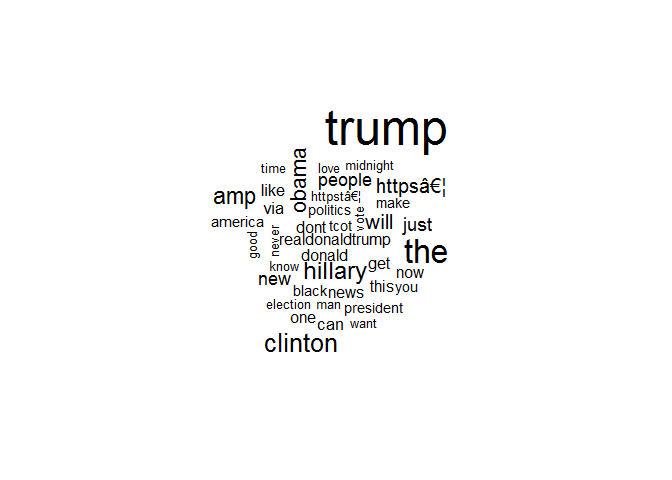

R Notebook
================

Context As part of the House Intelligence Committee investigation into how Russia may have influenced the 2016 US Election, Twitter released the screen names of almost 3000 Twitter accounts believed to be connected to Russia’s Internet Research Agency, a company known for operating social media troll accounts. Twitter immediately suspended these accounts, deleting their data from Twitter.com and the Twitter API. A team at NBC News including Ben Popken and EJ Fox was able to reconstruct a dataset consisting of a subset of the deleted data for their investigation and were able to show how these troll accounts went on attack during key election moments. This dataset is the body of this open-sourced reconstruction.

For more background, read the NBC news article publicizing the release: "Twitter deleted 200,000 Russian troll tweets. Read them here."

Content This dataset contains two CSV files. tweets.csv includes details on individual tweets, while users.csv includes details on individual accounts.

To recreate a link to an individual tweet found in the dataset, replace user\_key in <https://twitter.com/user_key/status/tweet_id> with the screen-name from the user\_key field and tweet\_id with the number in the tweet\_id field.

Following the links will lead to a suspended page on Twitter. But some copies of the tweets as they originally appeared, including images, can be found by entering the links on web caches like archive.org and archive.is.

Acknowledgements If you publish using the data, please credit NBC News and include a link to this page. Send questions to <ben.popken@nbcuni.com>.

``` r
library(caTools)
```

    ## Warning: package 'caTools' was built under R version 3.4.4

``` r
library(e1071)
```

    ## Warning: package 'e1071' was built under R version 3.4.4

``` r
library(SnowballC)
```

    ## Warning: package 'SnowballC' was built under R version 3.4.4

``` r
library(gmodels)
```

    ## Warning: package 'gmodels' was built under R version 3.4.4

``` r
library(rtweet)
```

    ## Warning: package 'rtweet' was built under R version 3.4.4

``` r
library(twitteR)
```

    ## Warning: package 'twitteR' was built under R version 3.4.4

    ## 
    ## Attaching package: 'twitteR'

    ## The following object is masked from 'package:rtweet':
    ## 
    ##     lookup_statuses

``` r
library(tidytext)
```

    ## Warning: package 'tidytext' was built under R version 3.4.4

``` r
library(dplyr)
```

    ## Warning: package 'dplyr' was built under R version 3.4.4

    ## 
    ## Attaching package: 'dplyr'

    ## The following objects are masked from 'package:twitteR':
    ## 
    ##     id, location

    ## The following objects are masked from 'package:stats':
    ## 
    ##     filter, lag

    ## The following objects are masked from 'package:base':
    ## 
    ##     intersect, setdiff, setequal, union

``` r
library(ggplot2)
```

    ## Warning: package 'ggplot2' was built under R version 3.4.4

``` r
library(wordcloud)
```

    ## Warning: package 'wordcloud' was built under R version 3.4.4

    ## Loading required package: RColorBrewer

``` r
library(tidyr)
```

    ## Warning: package 'tidyr' was built under R version 3.4.4

``` r
library(tm)
```

    ## Warning: package 'tm' was built under R version 3.4.4

    ## Loading required package: NLP

    ## Warning: package 'NLP' was built under R version 3.4.4

    ## 
    ## Attaching package: 'NLP'

    ## The following object is masked from 'package:ggplot2':
    ## 
    ##     annotate

``` r
library(effects)

#nt<-read.csv("C:/Users/John/Documents/R/russian_trolls/training.1600000.processed.noemoticon.csv")
#rt <-read.csv("file:///C:/Users/John/Documents/R/russian_trolls/tweets.csv/tweets.csv")

#set.seed(33)
#rt <- data.frame(sample_n(rt,6000,replace=FALSE))
#nt<-data.frame(sample_n(nt,6000,replace = FALSE))

#save(rt,file = "savedrt.RData")
#save(nt,file= "savednt.RData")
```

``` r
load("savednt.RData")

load("savedrt.RData")

#renameing Features
created_str <-as.Date(rt$created_str)
text<- as.character(rt$text)
colnames(nt)[6]<- as.character(c("text"))
colnames(nt)[3]<- "created_str"

#created_str<-as.Date(nt$created_str)


#adding a column Russian tweets
rt$r_nr<-"r"

#adding column to non_russian tweets
nt$r_nr<-"nr"
```

``` r
#combining data sets


tot_tweets<- full_join(nt,rt)
```

    ## Joining, by = c("created_str", "text", "r_nr")

    ## Warning: Column `created_str` joining factors with different levels,
    ## coercing to character vector

    ## Warning: Column `text` joining factors with different levels, coercing to
    ## character vector

``` r
tot_tweets <- tot_tweets[sample(nrow(tot_tweets)),]

#change character to factor
tot_tweets$r_nr<-factor(tot_tweets$r_nr, levels=c("r","nr"),ordered=TRUE)

  
text_corpus<- VCorpus(VectorSource(tot_tweets$text))
print(text_corpus)
```

    ## <<VCorpus>>
    ## Metadata:  corpus specific: 0, document level (indexed): 0
    ## Content:  documents: 12000

``` r
#cleaning tweets 
text_corpus_clean<-tm_map(text_corpus,content_transformer(tolower))

text_corpus_clean<-tm_map(text_corpus_clean,removeNumbers)

text_corpus_clean<-tm_map(text_corpus_clean,removeWords,stopwords())

text_corpus_clean<-tm_map(text_corpus_clean,removePunctuation)

                                                    text_corpus_clean<-tm_map(text_corpus_clean,stemDocument)
                                                                                                         
text_corpus_clean<-tm_map(text_corpus_clean,stripWhitespace)

text_dtm <-DocumentTermMatrix(text_corpus_clean,control =
                                list(wordLengths=c(0,Inf)))
```

``` r
text_dtm_train<- text_dtm[1:10000,]
text_dtm_test<- text_dtm[10000:12000,]


text_train_labels<- tot_tweets[1:10000,]$r_nr
text_test_labels<- tot_tweets[10000:12000,]$r_nr
```

``` r
#Overall word graph
wordcloud(text_corpus_clean, min.freq = 100,scale=c(2,.5),random.order = FALSE)
```



``` r
#Russian troll graph
rus<-subset(tot_tweets,r_nr=="r")
norus<-subset(tot_tweets,r_nr=="nr")

wordcloud(rus$text, max.words = 40,scale = c(3,.5))
```

    ## Warning in tm_map.SimpleCorpus(corpus, tm::removePunctuation):
    ## transformation drops documents

    ## Warning in tm_map.SimpleCorpus(corpus, function(x) tm::removeWords(x,
    ## tm::stopwords())): transformation drops documents



``` r
#no russian trolls graph
wordcloud(norus$text, max.words = 40, scale = c(3,.5))
```

    ## Warning in tm_map.SimpleCorpus(corpus, tm::removePunctuation):
    ## transformation drops documents

    ## Warning in tm_map.SimpleCorpus(corpus, tm::removePunctuation):
    ## transformation drops documents


``` r
#number of frequent terms
tweet_freq_words <- findFreqTerms(text_dtm_train, 5)
 
 str(tweet_freq_words)
```

    ##  chr [1:2609] "â" "â–¶" "…" "‘" "–" "—" "•" "“i" "â«" "â»" ...

``` r
#DTM
 
tweet_dtm_freq_train<- text_dtm_train[ , tweet_freq_words]
tweet_dtm_freq_test <- text_dtm_test[ , tweet_freq_words]

 convert_counts <- function(x) {
 x <- ifelse(x > 0, "Yes", "No")
 }

tweet_train <- apply(tweet_dtm_freq_train, MARGIN = 2,
 convert_counts)
tweet_test <- apply(tweet_dtm_freq_test, MARGIN = 2,
 convert_counts)
  
tweet_classifier<- naiveBayes(tweet_train,text_train_labels)
```

``` r
 tweet_test_pred <- predict(tweet_classifier, tweet_test)


 CrossTable(tweet_test_pred, text_test_labels,
 prop.chisq = FALSE, prop.t = FALSE,
 dnn = c('predicted', 'actual'))
```

    ## 
    ##  
    ##    Cell Contents
    ## |-------------------------|
    ## |                       N |
    ## |           N / Row Total |
    ## |           N / Col Total |
    ## |-------------------------|
    ## 
    ##  
    ## Total Observations in Table:  2001 
    ## 
    ##  
    ##              | actual 
    ##    predicted |         r |        nr | Row Total | 
    ## -------------|-----------|-----------|-----------|
    ##            r |       874 |        21 |       895 | 
    ##              |     0.977 |     0.023 |     0.447 | 
    ##              |     0.883 |     0.021 |           | 
    ## -------------|-----------|-----------|-----------|
    ##           nr |       116 |       990 |      1106 | 
    ##              |     0.105 |     0.895 |     0.553 | 
    ##              |     0.117 |     0.979 |           | 
    ## -------------|-----------|-----------|-----------|
    ## Column Total |       990 |      1011 |      2001 | 
    ##              |     0.495 |     0.505 |           | 
    ## -------------|-----------|-----------|-----------|
    ## 
    ## 

``` r
library(caret)
```

    ## Warning: package 'caret' was built under R version 3.4.4

    ## Loading required package: lattice

``` r
 #logistic Regression

sparse_dtm<-removeSparseTerms(text_dtm, 0.995)

tweetsSparse<-as.data.frame(as.matrix(sparse_dtm))
colnames(tweetsSparse)<-make.names(colnames(tweetsSparse))
tweetsSparse$r_nr<-tot_tweets$r_nr


set.seed(200)

split<- sample.split(tweetsSparse$r_nr,SplitRatio=0.7)

trainSparse<- subset(tweetsSparse, split=TRUE)
testSparse<- subset(tweetsSparse, split=FALSE)

tweet.logit <- glm(r_nr ~ ., data = trainSparse, family = "binomial")
```

    ## Warning: glm.fit: fitted probabilities numerically 0 or 1 occurred

``` r
tweet.logit.test<-predict(tweet.logit,type = "response", newdata = testSparse)


cmatrix_logregr<-table(tweetsSparse$r_nr, tweet.logit.test<0.5)

cmatrix_logregr
```

    ##     
    ##      FALSE TRUE
    ##   r    796 5204
    ##   nr  5902   98
