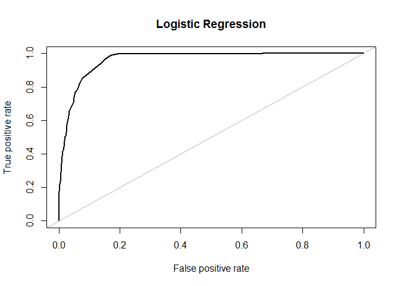
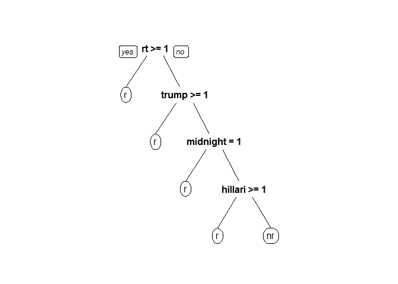

Russian Twitter Trolls
================

Context

After extensive government investigations, it was determined that Russia
and Iran tried to influence the U.S. 2016 presidential elections through
social media platforms. To work the government in a constructive manner
and keep its platform in a positive public light, Twitter made more than
ten million foreign troll’s tweets available for research. A team at NBC
News reconstructed a dataset of 200,000 Russian troll tweets and made it
available on Kaggle. Their research showed these troll accounts were
extremely active during key moments around the election. This project is
attempting to determine which tweets are Russian troll tweets and which
are not Russian troll tweets. It will be based on three predictive
models, Naïve Bayes, logistic regression, and random forest. Then we
will determine which predictive model is most effective when filtering
the Russian troll tweets. This could be one of many possible filtering
algorithms to help Twitter in identifying fake accounts of Russian or
even Iranian trolls. There are two major reasons for Twitter to identify
fake accounts: rebuilding public trust in their platform, and influence
in the government’s creation of legislation regulating social media.

For more background, read the NBC news article publicizing the release:
“Twitter deleted 200,000 Russian troll tweets.”[NBC Russian
Tweets](https://www.nbcnews.com/tech/social-media/now-available-more-200-000-deleted-russian-troll-tweets-n844731)

Content This dataset contains two CSV files. tweets.csv includes details
on individual tweets from known Russain troll accounts,and
noemoticon.csv file that is pre-russain trolls(2009).

To recreate a link to an individual tweet found in the dataset, replace
user\_key in <https://twitter.com/user_key/status/tweet_id> with the
screen-name from the user\_key field and tweet\_id with the number in
the tweet\_id field.

Following the links will lead to a suspended page on Twitter. But some
copies of the tweets as they originally appeared, including images, can
be found by entering the links on web caches like archive.org and
archive.is.

Acknowledgements If you publish using the data, please credit NBC News
and include a link to this page. Send questions to
<ben.popken@nbcuni.com>.

THIS Project

In this mark down, the russian troll data set and a sentiment data set
that was pre 2014 was used for analysis. The Russian troll accounts were
from September 2014 until September 2017. So I found tweets that were
produced from April to May 2009. Therefore, camparisons of troll and
non-troll data could be made.

``` r
library(ROCR)
```

    ## Warning: package 'ROCR' was built under R version 3.4.4

    ## Loading required package: gplots

    ## Warning: package 'gplots' was built under R version 3.4.4

    ## 
    ## Attaching package: 'gplots'

    ## The following object is masked from 'package:stats':
    ## 
    ##     lowess

``` r
library(caTools)# ROC, AUC
```

    ## Warning: package 'caTools' was built under R version 3.4.4

``` r
library(e1071) #  Naive Bayes 
```

    ## Warning: package 'e1071' was built under R version 3.4.4

``` r
library(SnowballC) # stemming
```

    ## Warning: package 'SnowballC' was built under R version 3.4.4

``` r
library(gmodels)
```

    ## Warning: package 'gmodels' was built under R version 3.4.4

``` r
library(tidytext)
```

    ## Warning: package 'tidytext' was built under R version 3.4.4

``` r
library(dplyr)
```

    ## Warning: package 'dplyr' was built under R version 3.4.4

    ## 
    ## Attaching package: 'dplyr'

    ## The following objects are masked from 'package:stats':
    ## 
    ##     filter, lag

    ## The following objects are masked from 'package:base':
    ## 
    ##     intersect, setdiff, setequal, union

``` r
library(ggplot2)
```

    ## Warning: package 'ggplot2' was built under R version 3.4.4

``` r
library(wordcloud)
```

    ## Warning: package 'wordcloud' was built under R version 3.4.4

    ## Loading required package: RColorBrewer

    ## 
    ## Attaching package: 'wordcloud'

    ## The following object is masked from 'package:gplots':
    ## 
    ##     textplot

``` r
library(tidyr)
```

    ## Warning: package 'tidyr' was built under R version 3.4.4

``` r
library(tm) # text data
```

    ## Warning: package 'tm' was built under R version 3.4.4

    ## Loading required package: NLP

    ## Warning: package 'NLP' was built under R version 3.4.4

    ## 
    ## Attaching package: 'NLP'

    ## The following object is masked from 'package:ggplot2':
    ## 
    ##     annotate

``` r
library(effects) # regession models
library(glm2)
```

    ## Warning: package 'glm2' was built under R version 3.4.4

``` r
#nt<-read.csv("C:/Users/John/Documents/R/russian_trolls/training.1600000.processed.noemoticon.csv")
#rt <-read.csv("file:///C:/Users/John/Documents/R/russian_trolls/tweets.csv/tweets.csv")

#set.seed(33)
#rt <- data.frame(sample_n(rt,6000,replace=FALSE))
#nt<-data.frame(sample_n(nt,6000,replace = FALSE))

#save(rt,file = "savedrt.RData")
#save(nt,file= "savednt.RData")
```

Because the CSV files were so large, two Rdata files were created. This
helped with a shorter run time and committing to Github.

``` r
load("savednt.RData")

load("savedrt.RData")

#renameing Features
created_str <-as.Date(rt$created_str)
text<- as.character(rt$text)
colnames(nt)[6]<- as.character(c("text"))
colnames(nt)[3]<- "created_str"

#extracting columns
rtext<-select(rt,"text")
ntext<-select(nt,"text")


#adding a column Russian tweets
rtext$r_nr<-"r"

#adding column to non_russian tweets
ntext$r_nr<-"nr"
```

``` r
#combining data sets, sample function randomizes order of rows

tot_tweets<- rbind(ntext,rtext,stringAsfactors=FALSE)
tot_tweets <- tot_tweets[sample(nrow(tot_tweets)),]

#change character to factor
tot_tweets$r_nr<-factor(tot_tweets$r_nr, levels=c("r","nr"),ordered=FALSE)

#creating a corpus for the twitter text
text_corpus<- VCorpus(VectorSource(tot_tweets$text))
print(text_corpus)
```

    ## <<VCorpus>>
    ## Metadata:  corpus specific: 0, document level (indexed): 0
    ## Content:  documents: 12001

``` r
#cleaning tweets 
text_corpus_clean<-tm_map(text_corpus,content_transformer(tolower))

text_corpus_clean<-tm_map(text_corpus_clean,removeNumbers)

text_corpus_clean<-tm_map(text_corpus_clean,removeWords,stopwords())

text_corpus_clean<-tm_map(text_corpus_clean,removePunctuation)

                                                    text_corpus_clean<-tm_map(text_corpus_clean,stemDocument)
                                                                                                         
text_corpus_clean<-tm_map(text_corpus_clean,stripWhitespace)


#Tokenize the data
text_dtm <-DocumentTermMatrix(text_corpus_clean,control =
                                list(wordLengths=c(0,Inf)))
```

We separate the data into a training set and a test set. Then create the
labels for the two sets.

``` r
text_dtm_train<- text_dtm[1:10000,]
text_dtm_test<- text_dtm[10001:12000,]


text_train_labels<- tot_tweets[1:10000,]$r_nr
text_test_labels<- tot_tweets[10001:12000,]$r_nr
```

We can now create three word clouds. The first wordcloud shows all of
the data together. The second cloud show just the russian troll texts.
The third is no Russian trolls at all.

``` r
#Overall word graph
wordcloud(text_corpus_clean, min.freq = 100,scale=c(2,.5),random.order = FALSE)
```

<!-- -->

``` r
#Russian troll graph
rus<-subset(tot_tweets,r_nr=="r")
norus<-subset(tot_tweets,r_nr=="nr")

wordcloud(rus$text, max.words = 40,scale = c(3,.5))
```

    ## Warning in tm_map.SimpleCorpus(corpus, tm::removePunctuation):
    ## transformation drops documents

    ## Warning in tm_map.SimpleCorpus(corpus, function(x) tm::removeWords(x,
    ## tm::stopwords())): transformation drops documents

<!-- -->

``` r
#no russian trolls graph
wordcloud(norus$text, max.words = 40, scale = c(3,.5))
```

    ## Warning in tm_map.SimpleCorpus(corpus, tm::removePunctuation):
    ## transformation drops documents
    
    ## Warning in tm_map.SimpleCorpus(corpus, tm::removePunctuation):
    ## transformation drops documents

<!-- -->

``` r
#number of frequent terms. frenquency filter of words used less than 20 times
tweet_freq_words <- findFreqTerms(text_dtm_train, 20)
 
 str(tweet_freq_words)
```

    ##  chr [1:641] "…" "‘" "–" "“" "abl" "accept" "account" "accus" ...

``` r
#create DTM
 
tweet_dtm_freq_train<- text_dtm_train[ , tweet_freq_words]
tweet_dtm_freq_test <- text_dtm_test[ , tweet_freq_words]

#Function for Change to categorical classifier, then apply to the columns
 convert_counts <- function(x) {
 x <- ifelse(x > 0, "Yes", "No")
 }

tweet_train <- apply(tweet_dtm_freq_train, MARGIN = 2,
 convert_counts)
tweet_test <- apply(tweet_dtm_freq_test, MARGIN = 2,
 convert_counts)
  
tweet_classifier<- naiveBayes(tweet_train,text_train_labels)
```

``` r
 tweet_test_pred <- predict(tweet_classifier, tweet_test)


 CrossTable(tweet_test_pred, text_test_labels,
 prop.chisq = FALSE, prop.t = FALSE,
 dnn = c('predicted', 'actual'))
```

    ## 
    ##  
    ##    Cell Contents
    ## |-------------------------|
    ## |                       N |
    ## |           N / Row Total |
    ## |           N / Col Total |
    ## |-------------------------|
    ## 
    ##  
    ## Total Observations in Table:  2000 
    ## 
    ##  
    ##              | actual 
    ##    predicted |         r |        nr | Row Total | 
    ## -------------|-----------|-----------|-----------|
    ##            r |       863 |        29 |       892 | 
    ##              |     0.967 |     0.033 |     0.446 | 
    ##              |     0.893 |     0.028 |           | 
    ## -------------|-----------|-----------|-----------|
    ##           nr |       103 |      1005 |      1108 | 
    ##              |     0.093 |     0.907 |     0.554 | 
    ##              |     0.107 |     0.972 |           | 
    ## -------------|-----------|-----------|-----------|
    ## Column Total |       966 |      1034 |      2000 | 
    ##              |     0.483 |     0.517 |           | 
    ## -------------|-----------|-----------|-----------|
    ## 
    ## 

``` r
#create ROC for Naive Bayes
troc<-predict(tweet_classifier,tweet_test, type = "raw")
predt<- prediction(troc[,"r"],text_test_labels)


#calculate the area
auc<-performance(predt,"auc")


perf_r<- performance(predt, measure ='tpr',x.measure='fpr')
plot(perf_r,colorize=T,main="Naive Bayes")
```

<!-- -->

``` r
print(auc)
```

    ## An object of class "performance"
    ## Slot "x.name":
    ## [1] "None"
    ## 
    ## Slot "y.name":
    ## [1] "Area under the ROC curve"
    ## 
    ## Slot "alpha.name":
    ## [1] "none"
    ## 
    ## Slot "x.values":
    ## list()
    ## 
    ## Slot "y.values":
    ## [[1]]
    ## [1] 0.9774539
    ## 
    ## 
    ## Slot "alpha.values":
    ## list()

``` r
library(caret)
```

    ## Warning: package 'caret' was built under R version 3.4.4

    ## Loading required package: lattice

``` r
library(safeBinaryRegression)
```

    ## Warning: package 'safeBinaryRegression' was built under R version 3.4.4

    ## Loading required package: lpSolveAPI

    ## Warning: package 'lpSolveAPI' was built under R version 3.4.4

    ## 
    ## Attaching package: 'safeBinaryRegression'

    ## The following object is masked from 'package:stats':
    ## 
    ##     glm

``` r
library(glmnet)
```

    ## Warning: package 'glmnet' was built under R version 3.4.4

    ## Loading required package: Matrix

    ## 
    ## Attaching package: 'Matrix'

    ## The following object is masked from 'package:tidyr':
    ## 
    ##     expand

    ## Loading required package: foreach

    ## Warning: package 'foreach' was built under R version 3.4.4

    ## Loaded glmnet 2.0-16

``` r
library(Matrix)
library(pROC)
```

    ## Warning: package 'pROC' was built under R version 3.4.4

    ## Type 'citation("pROC")' for a citation.

    ## 
    ## Attaching package: 'pROC'

    ## The following object is masked from 'package:glmnet':
    ## 
    ##     auc

    ## The following object is masked from 'package:gmodels':
    ## 
    ##     ci

    ## The following objects are masked from 'package:stats':
    ## 
    ##     cov, smooth, var

``` r
 #logistic Regression

sparse_dtm<-removeSparseTerms(text_dtm, 0.995) #terms appear in more than .5% of tweets or 230 

#new Data frame
tweetsSparse<-as.data.frame(as.matrix(sparse_dtm))
colnames(tweetsSparse)<-make.names(colnames(tweetsSparse))
tweetsSparse$r_nr<-tot_tweets$r_nr

#split the data set

trainSparse<- tweetsSparse[1:9000,]
testS<- tweetsSparse[9001:12000,]

#logistic regression model
tweet.logit<- glm2(r_nr~.,trainSparse, family = "binomial")
```

    ## Warning: glm.fit2: fitted probabilities numerically 0 or 1 occurred

``` r
tweet.logit.test<-predict(tweet.logit,type = "response", newdata = testS,na.action=na.exclude)


cmatrix_logregr<-table(testS$r_nr, tweet.logit.test>0.5)

cmatrix_logregr
```

    ##     
    ##      FALSE TRUE
    ##   r   1276  189
    ##   nr    37 1498

``` r
tweet.logit.test1<-predict(tweet.logit, type = "response", newdata = trainSparse)
cmatrix1 <-table(trainSparse$r_nr,tweet.logit.test1>0.5)

cmatrix1
```

    ##     
    ##      FALSE TRUE
    ##   r   3928  606
    ##   nr    67 4398

``` r
#create ROC for Logistic Regression

troc2<-roc(testS$r_nr~tweet.logit.test)

plot(troc2)
```

<!-- -->

``` r
#calculate the area under the ROC
auc2<-auc(troc2)


print(auc2)
```

    ## Area under the curve: 0.969

``` r
#Descision Tree
library(rpart)
```

    ## Warning: package 'rpart' was built under R version 3.4.4

``` r
library(rpart.plot)
```

    ## Warning: package 'rpart.plot' was built under R version 3.4.4

``` r
library(e1071)
library(irr)
```

    ## Warning: package 'irr' was built under R version 3.4.4

    ## Loading required package: lpSolve

    ## Warning: package 'lpSolve' was built under R version 3.4.4

``` r
tweetcart<- rpart(r_nr~.,data = trainSparse, method = "class")
prp(tweetcart)
```

<!-- -->

``` r
predtcart<-predict(tweetcart,newdata=testS,type = "class")
cartable<-table(testS$r_nr,predtcart)

#cross-validation

tr.control<- trainControl(method="cv",number=5)
cp.grid<-expand.grid(.cp= (0:5)*0.001)
tr<-train(r_nr~.,data = tweetsSparse, method="rpart", trControl=tr.control,tuneGrid=cp.grid, na.action = na.omit )

best.tree<-tr$finalModel
prp(best.tree)
```

<!-- -->

``` r
#set.seed(123)
#folds <- createFolds(tweetsSparse$r_nr, k = 5)

# cv_results <- lapply(folds, function(x) {
# russ_train <- tweetsSparse[-x, ]
 #russ_test <- tweetsSparse[x, ]
# russ_model <- C5.0(r_nr ~ ., data = russ_train)
 #russ_pred <- predict(tweetcart, russ_test)
 #russ_actual <- russ_test$r_nr
 #kappa <- kappam.light(data.frame(russ_actual, russ_pred))$value
 #return(kappa)
 #})

 #mean(unlist(cv_results))
```

``` r
print(cartable)
```

    ##     predtcart
    ##         r   nr
    ##   r  1176  289
    ##   nr    5 1530

``` r
#Random Forest
library(randomForest)
```

    ## Warning: package 'randomForest' was built under R version 3.4.4

    ## randomForest 4.6-14

    ## Type rfNews() to see new features/changes/bug fixes.

    ## 
    ## Attaching package: 'randomForest'

    ## The following object is masked from 'package:ggplot2':
    ## 
    ##     margin

    ## The following object is masked from 'package:dplyr':
    ## 
    ##     combine

``` r
russianForest<- randomForest(r_nr~.,data=trainSparse,nodesize=25,ntrees=200,na.action=na.roughfix)
predictForest<-predict(russianForest, newdata=testS)

table(testS$r_nr,predictForest)
```

    ##     predictForest
    ##         r   nr
    ##   r  1284  181
    ##   nr   45 1490

``` r
#random forest ROC
rfroc<-prediction(as.numeric(predictForest),as.numeric(testS$r_nr))
perf_3<- performance(rfroc,measure = 'tpr',x.measure = 'fpr')
plot(perf_3, colorize =T, main= "Random Forest")
```

<!-- -->

If any of the three terms rt,trump, or clinton showed themselves in the
Russian troll accounts.

Overall Naive Bayes return the most promising results for filtering
tweets against a wide range of tweets.
