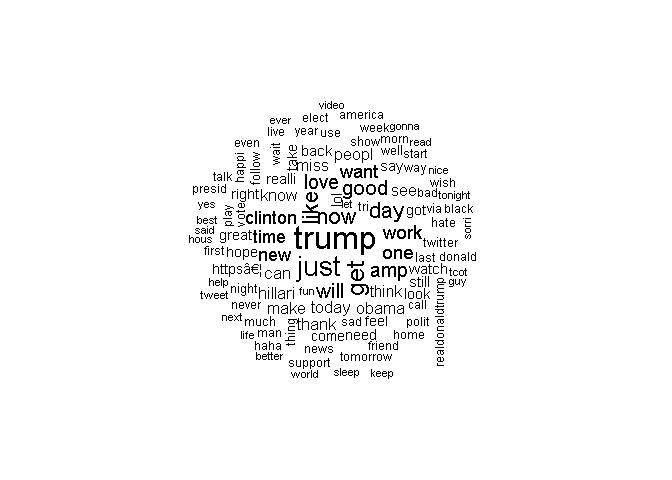
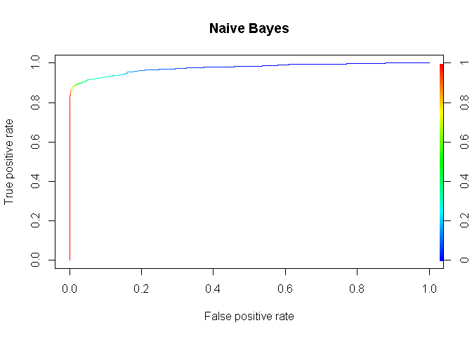
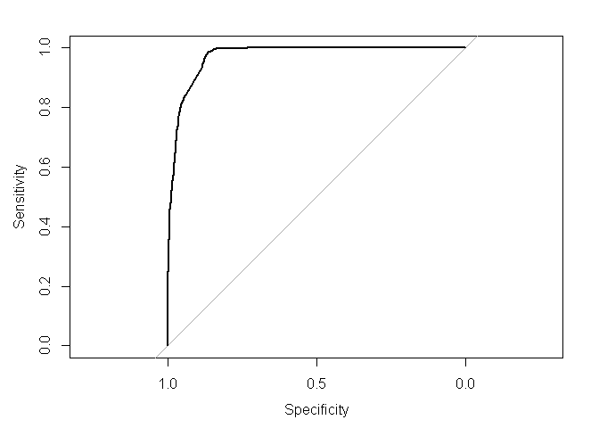
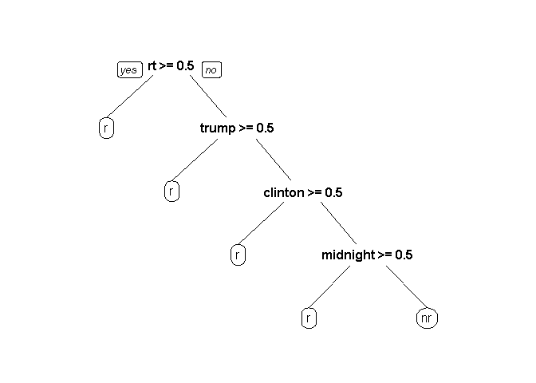
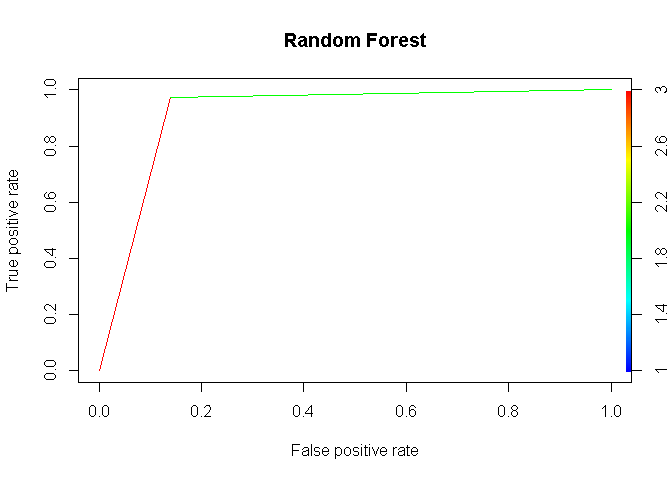

Russian Twitter Trolls
================

Background
----------

After extensive government investigations, it was determined that Russia and Iran tried to influence the U.S. 2016 presidential elections through social media platforms. To work with the government in a constructive manner and keep its platform in a positive public light, Twitter made more than ten million foreign troll’s tweets available for research. A team at NBC News reconstructed a dataset of 200,000 Russian troll tweets and made it available on Kaggle. Their research showed these troll accounts were extremely active during key moments around the election. This project is attempting to determine which tweets are Russian troll tweets and which are not Russian troll tweets. It will be based on three predictive models, Naïve Bayes, Logistic Regression, and Random Forest. Then we will determine which predictive model is most effective when filtering the Russian troll tweets. This could be one of many possible filtering algorithms to help Twitter in identifying fake accounts of Russian or even Iranian trolls. There are two major reasons for Twitter to identify fake accounts:

1.  Rebuilding public trust in their platform, and
2.  influence the government’s legislation regulating social media

For more background, read the NBC news article publicizing the release: "Twitter deleted 200,000 Russian troll tweets."[NBC Russian Tweets](https://www.nbcnews.com/tech/social-media/now-available-more-200-000-deleted-russian-troll-tweets-n844731)

Content
-------

This dataset contains two CSV files. tweets.csv includes details on individual tweets from known Russain troll accounts,and noemoticon.csv file that is pre-russain trolls(2009).

To recreate a link to an individual tweet found in the dataset, replace user\_key in <https://twitter.com/user_key/status/tweet_id> with the screen-name from the user\_key field and tweet\_id with the number in the tweet\_id field.

Following the links will lead to a suspended page on Twitter. But some copies of the tweets as they originally appeared, including images, can be found by entering the links on web caches like archive.org and archive.is.

Acknowledgements If you publish using the data, please credit NBC News and include a link to this page. Send questions to <ben.popken@nbcuni.com>.

This Project
------------

In this markdown document, the russian troll data set and a sentiment data set that was pre 2014 was used for analysis. The Russian troll accounts were from September 2014 until September 2017. So I found tweets that were produced from April to May 2009. Therefore, camparisons of troll and non-troll data could be made.

``` r
library(ROCR)
```

    ## Loading required package: gplots

    ## 
    ## Attaching package: 'gplots'

    ## The following object is masked from 'package:stats':
    ## 
    ##     lowess

``` r
library(caTools)# ROC, AUC
```

    ## Warning: package 'caTools' was built under R version 3.5.2

``` r
library(e1071) #  Naive Bayes 
library(SnowballC) # stemming
```

    ## Warning: package 'SnowballC' was built under R version 3.5.2

``` r
library(gmodels)
library(tidytext)
```

    ## Warning: package 'tidytext' was built under R version 3.5.3

``` r
library(dplyr)
```

    ## 
    ## Attaching package: 'dplyr'

    ## The following objects are masked from 'package:stats':
    ## 
    ##     filter, lag

    ## The following objects are masked from 'package:base':
    ## 
    ##     intersect, setdiff, setequal, union

``` r
library(ggplot2)
```

    ## Warning: package 'ggplot2' was built under R version 3.5.1

``` r
library(wordcloud)
```

    ## Warning: package 'wordcloud' was built under R version 3.5.2

    ## Loading required package: RColorBrewer

    ## Warning: package 'RColorBrewer' was built under R version 3.5.2

    ## 
    ## Attaching package: 'wordcloud'

    ## The following object is masked from 'package:gplots':
    ## 
    ##     textplot

``` r
library(tidyr)
library(tm) # text data
```

    ## Warning: package 'tm' was built under R version 3.5.2

    ## Loading required package: NLP

    ## Warning: package 'NLP' was built under R version 3.5.2

    ## 
    ## Attaching package: 'NLP'

    ## The following object is masked from 'package:ggplot2':
    ## 
    ##     annotate

``` r
library(effects) # regession models
```

    ## Warning: package 'effects' was built under R version 3.5.3

    ## Loading required package: carData

    ## lattice theme set by effectsTheme()
    ## See ?effectsTheme for details.

``` r
library(glm2)
```

    ## Warning: package 'glm2' was built under R version 3.5.2

``` r
#nt<-read.csv("C:/Users/John/Documents/R/russian_trolls/training.1600000.processed.noemoticon.csv")
#rt <-read.csv("file:///C:/Users/John/Documents/R/russian_trolls/tweets.csv/tweets.csv")

#set.seed(33)
#rt <- data.frame(sample_n(rt,6000,replace=FALSE))
#nt<-data.frame(sample_n(nt,6000,replace = FALSE))

#save(rt,file = "savedrt.RData")
#save(nt,file= "savednt.RData")
```

Because the CSV files were so large, two Rdata files were created. This helped with a shorter run time and committing to Github.

``` r
load("savednt.RData")

load("savedrt.RData")

#renaming Features
created_str <- as.Date(rt$created_str)
text <- as.character(rt$text)
colnames(nt)[6] <- as.character(c("text"))
colnames(nt)[3] <- "created_str"

#extracting columns
rtext <- select(rt,"text")
ntext <- select(nt,"text")


#adding a column Russian tweets
rtext$r_nr <- "r"

#adding column to non_russian tweets
ntext$r_nr <- "nr"


str(rt)
```

    ## 'data.frame':    6000 obs. of  16 variables:
    ##  $ user_id              : num  1.69e+09 1.73e+09 1.69e+09 1.66e+09 7.50e+17 ...
    ##  $ user_key             : Factor w/ 454 levels "_billy_moyer_",..: 282 281 194 248 402 250 22 141 147 327 ...
    ##  $ created_at           : num  1.45e+12 1.48e+12 1.47e+12 1.49e+12 1.50e+12 ...
    ##  $ created_str          : Factor w/ 198422 levels "","2014-07-14 18:04:55",..: 21848 137335 60546 182417 194370 25495 86616 117745 46228 170910 ...
    ##  $ retweet_count        : int  NA NA NA NA NA NA 0 0 0 NA ...
    ##  $ retweeted            : Factor w/ 2 levels "","false": 1 1 1 1 1 1 2 2 2 1 ...
    ##  $ favorite_count       : int  NA NA NA NA NA NA 0 0 0 NA ...
    ##  $ text                 : Factor w/ 174986 levels "","'#SickHillary refuses to answer question about concussion, walks away. #LaueringTheBar\nhttps://t.co/7DK8P8yiC0"| __truncated__,..: 39110 120591 86950 78022 100967 36640 87595 159766 99698 127603 ...
    ##  $ tweet_id             : num  6.77e+17 8.09e+17 7.75e+17 8.41e+17 8.85e+17 ...
    ##  $ source               : Factor w/ 20 levels "","<a href=\"http://bufferapp.com\" rel=\"nofollow\">Buffer</a>",..: 1 1 1 1 1 1 11 11 11 1 ...
    ##  $ hashtags             : Factor w/ 18343 levels "[\"_Malikalovess\"]",..: 17126 5640 18343 18343 18343 17534 18343 7416 8968 18343 ...
    ##  $ expanded_urls        : Factor w/ 22215 levels "[\"\",\"\",\"\",\"\",\"\",\"\",\"\",\"\",\"\",\"\",\"\",\"\",\"\",\"\",\"\",\"\",\"\",\"\",\"\",\"\",\"\",\"\",\"\",\"\",\"\"]",..: 22215 22215 22215 22215 22215 22215 5869 19 22215 22215 ...
    ##  $ posted               : Factor w/ 1 level "POSTED": 1 1 1 1 1 1 1 1 1 1 ...
    ##  $ mentions             : Factor w/ 16683 levels "[\"___lorraine__\"]",..: 16683 16683 16683 16683 16683 16683 5298 16286 7416 16683 ...
    ##  $ retweeted_status_id  : num  NA NA NA NA NA ...
    ##  $ in_reply_to_status_id: num  NA NA NA NA NA NA NA NA NA NA ...

``` r
str(nt)
```

    ## 'data.frame':    6000 obs. of  6 variables:
    ##  $ X0              : int  0 4 4 0 0 4 4 0 0 4 ...
    ##  $ X1467810369     : num  1.83e+09 1.93e+09 2.05e+09 1.55e+09 2.07e+09 ...
    ##  $ created_str     : Factor w/ 774362 levels "Fri Apr 17 20:30:31 PDT 2009",..: 224461 717527 20511 244638 444132 484226 392907 58846 248035 136040 ...
    ##  $ NO_QUERY        : Factor w/ 1 level "NO_QUERY": 1 1 1 1 1 1 1 1 1 1 ...
    ##  $ X_TheSpecialOne_: Factor w/ 659775 levels "____________g",..: 313608 618339 408127 620180 375781 471444 375480 180113 264013 641922 ...
    ##  $ text            : Factor w/ 1581465 levels "\177in the process of getting jaunty- ubuntu 9.04 disk is finally getting a workout ",..: 709235 1569856 1415969 7437 315876 623064 1419923 1348303 1374126 96507 ...

The output is two data frames: rtext and ntext. each with 6k tweets and each are labeled

``` r
#combining data sets, sample function randomizes order of rows

tot_tweets <- rbind(ntext,rtext,stringAsfactors = FALSE)
tot_tweets <- tot_tweets[sample(nrow(tot_tweets)),]

#change character to factor
tot_tweets$r_nr <- factor(tot_tweets$r_nr, levels = c("r","nr"),ordered = FALSE)

#creating a corpus for the twitter text
text_corpus <- VCorpus(VectorSource(tot_tweets$text))
print(text_corpus)
```

    ## <<VCorpus>>
    ## Metadata:  corpus specific: 0, document level (indexed): 0
    ## Content:  documents: 12001

``` r
#cleaning tweets 
text_corpus_clean <- tm_map(text_corpus,content_transformer(tolower))

text_corpus_clean <- tm_map(text_corpus_clean,removeNumbers)

text_corpus_clean <- tm_map(text_corpus_clean,removeWords,stopwords())

text_corpus_clean <- tm_map(text_corpus_clean,removePunctuation)

text_corpus_clean <- tm_map(text_corpus_clean,stemDocument)
                                                                                                         
text_corpus_clean <- tm_map(text_corpus_clean,stripWhitespace)


#Tokenize the data
text_dtm <- DocumentTermMatrix(text_corpus_clean,control =
                                list(wordLengths = c(0,Inf)))
```

We separate the data into a training set and a test set. Then create the labels for the two sets.

``` r
text_dtm_train<- text_dtm[1:10000,]
text_dtm_test<- text_dtm[10001:12000,]


text_train_labels<- tot_tweets[1:10000,]$r_nr
text_test_labels<- tot_tweets[10001:12000,]$r_nr
```

We can now create three word clouds. The first wordcloud shows all of the data together. The second cloud show just the russian troll texts. The third is no Russian trolls at all.

``` r
#Overall word graph
wordcloud(text_corpus_clean, min.freq = 100,scale=c(2,.5),random.order = FALSE)
```



``` r
#Russian troll graph
rus<-subset(tot_tweets,r_nr=="r")
norus<-subset(tot_tweets,r_nr=="nr")

wordcloud(rus$text, max.words = 40,scale = c(3,.5))
```

    ## Warning in tm_map.SimpleCorpus(corpus, tm::removePunctuation):
    ## transformation drops documents

    ## Warning in tm_map.SimpleCorpus(corpus, function(x) tm::removeWords(x,
    ## tm::stopwords())): transformation drops documents


``` r
#no russian trolls graph
wordcloud(norus$text, max.words = 40, scale = c(3,.5))
```

    ## Warning in tm_map.SimpleCorpus(corpus, tm::removePunctuation):
    ## transformation drops documents

    ## Warning in tm_map.SimpleCorpus(corpus, tm::removePunctuation):
    ## transformation drops documents


``` r
#number of frequent terms. frenquency filter of words used less than 20 times
tweet_freq_words <- findFreqTerms(text_dtm_train, 20)
 
 str(tweet_freq_words)
```

    ##  chr [1:668] "â\200¦" "â\200\230" "â\200“" "abl" "accept" "account" ...

``` r
#create DTM
 
tweet_dtm_freq_train<- text_dtm_train[ , tweet_freq_words]
tweet_dtm_freq_test <- text_dtm_test[ , tweet_freq_words]

#Function for Change to categorical classifier, then apply to the columns
 convert_counts <- function(x) {
 x <- ifelse(x > 0, "Yes", "No")
 }

tweet_train <- apply(tweet_dtm_freq_train, MARGIN = 2,
 convert_counts)
tweet_test <- apply(tweet_dtm_freq_test, MARGIN = 2,
 convert_counts)
  
tweet_classifier<- naiveBayes(tweet_train,text_train_labels)
```

``` r
 tweet_test_pred <- predict(tweet_classifier, tweet_test)


 CrossTable(tweet_test_pred, text_test_labels,
 prop.chisq = FALSE, prop.t = FALSE,
 dnn = c('predicted', 'actual'))
```

    ## 
    ##  
    ##    Cell Contents
    ## |-------------------------|
    ## |                       N |
    ## |           N / Row Total |
    ## |           N / Col Total |
    ## |-------------------------|
    ## 
    ##  
    ## Total Observations in Table:  2000 
    ## 
    ##  
    ##              | actual 
    ##    predicted |         r |        nr | Row Total | 
    ## -------------|-----------|-----------|-----------|
    ##            r |       909 |        25 |       934 | 
    ##              |     0.973 |     0.027 |     0.467 | 
    ##              |     0.896 |     0.025 |           | 
    ## -------------|-----------|-----------|-----------|
    ##           nr |       105 |       961 |      1066 | 
    ##              |     0.098 |     0.902 |     0.533 | 
    ##              |     0.104 |     0.975 |           | 
    ## -------------|-----------|-----------|-----------|
    ## Column Total |      1014 |       986 |      2000 | 
    ##              |     0.507 |     0.493 |           | 
    ## -------------|-----------|-----------|-----------|
    ## 
    ## 

``` r
#create ROC for Naive Bayes
troc<-predict(tweet_classifier,tweet_test, type = "raw")
predt<- prediction(troc[,"r"],text_test_labels)


#calculate the area
auc<-performance(predt,"auc")


perf_r<- performance(predt, measure ='tpr',x.measure='fpr')
plot(perf_r,colorize=T,main="Naive Bayes")
```



``` r
print(auc)
```

    ## An object of class "performance"
    ## Slot "x.name":
    ## [1] "None"
    ## 
    ## Slot "y.name":
    ## [1] "Area under the ROC curve"
    ## 
    ## Slot "alpha.name":
    ## [1] "none"
    ## 
    ## Slot "x.values":
    ## list()
    ## 
    ## Slot "y.values":
    ## [[1]]
    ## [1] 0.9756177
    ## 
    ## 
    ## Slot "alpha.values":
    ## list()

``` r
library(caret)
```

    ## Warning: package 'caret' was built under R version 3.5.1

    ## Loading required package: lattice

``` r
library(safeBinaryRegression)
```

    ## Warning: package 'safeBinaryRegression' was built under R version 3.5.2

    ## Loading required package: lpSolveAPI

    ## Warning: package 'lpSolveAPI' was built under R version 3.5.2

    ## 
    ## Attaching package: 'safeBinaryRegression'

    ## The following object is masked from 'package:stats':
    ## 
    ##     glm

``` r
library(glmnet)
```

    ## Warning: package 'glmnet' was built under R version 3.5.3

    ## Loading required package: Matrix

    ## 
    ## Attaching package: 'Matrix'

    ## The following object is masked from 'package:tidyr':
    ## 
    ##     expand

    ## Loading required package: foreach

    ## Loaded glmnet 2.0-16

``` r
library(Matrix)
library(pROC)
```

    ## Type 'citation("pROC")' for a citation.

    ## 
    ## Attaching package: 'pROC'

    ## The following object is masked from 'package:glmnet':
    ## 
    ##     auc

    ## The following object is masked from 'package:gmodels':
    ## 
    ##     ci

    ## The following objects are masked from 'package:stats':
    ## 
    ##     cov, smooth, var

``` r
 #logistic Regression

sparse_dtm<-removeSparseTerms(text_dtm, 0.995) #terms appear in more than .5% of tweets or 230 

#new Data frame
tweetsSparse<-as.data.frame(as.matrix(sparse_dtm))
colnames(tweetsSparse)<-make.names(colnames(tweetsSparse))
tweetsSparse$r_nr<-tot_tweets$r_nr

#split the data set

trainSparse<- tweetsSparse[1:9000,]
testS<- tweetsSparse[9001:12000,]

#logistic regression model
tweet.logit<- glm2(r_nr~.,trainSparse, family = "binomial")
```

    ## Warning: glm.fit2: fitted probabilities numerically 0 or 1 occurred

``` r
tweet.logit.test<-predict(tweet.logit,type = "response", newdata = testS,na.action=na.exclude)


cmatrix_logregr<-table(testS$r_nr, tweet.logit.test>0.5)

cmatrix_logregr
```

    ##     
    ##      FALSE TRUE
    ##   r   1325  205
    ##   nr    29 1441

``` r
tweet.logit.test1<-predict(tweet.logit, type = "response", newdata = trainSparse)
cmatrix1 <-table(trainSparse$r_nr,tweet.logit.test1>0.5)

cmatrix1
```

    ##     
    ##      FALSE TRUE
    ##   r   3883  587
    ##   nr    69 4460

``` r
#create ROC for Logistic Regression

troc2<-roc(testS$r_nr~tweet.logit.test)

plot(troc2)
```



``` r
#calculate the area under the ROC
auc2<-auc(troc2)


print(auc2)
```

    ## Area under the curve: 0.9708

``` r
#Descision Tree
library(rpart)
library(rpart.plot)
tweetcart<- rpart(r_nr~.,data = trainSparse, method = "class")
prp(tweetcart)
```



``` r
predtcart<-predict(tweetcart,newdata=testS,type = "class")
cartable<-table(testS$r_nr,predtcart)


print(cartable)
```

    ##     predtcart
    ##         r   nr
    ##   r  1210  320
    ##   nr    3 1467

``` r
#Random Forest
library(randomForest)
```

    ## Warning: package 'randomForest' was built under R version 3.5.1

    ## randomForest 4.6-14

    ## Type rfNews() to see new features/changes/bug fixes.

    ## 
    ## Attaching package: 'randomForest'

    ## The following object is masked from 'package:ggplot2':
    ## 
    ##     margin

    ## The following object is masked from 'package:dplyr':
    ## 
    ##     combine

``` r
russianForest<- randomForest(r_nr~.,data=trainSparse,nodesize=25,ntrees=200,na.action=na.roughfix)
predictForest<-predict(russianForest, newdata=testS)

table(testS$r_nr,predictForest)
```

    ##     predictForest
    ##         r   nr
    ##   r  1317  213
    ##   nr   40 1430

``` r
#random forest ROC
rfroc<-prediction(as.numeric(predictForest),as.numeric(testS$r_nr))
perf_3<- performance(rfroc,measure = 'tpr',x.measure = 'fpr')
plot(perf_3, colorize =T, main= "Random Forest")
```



If any of the three terms rt,trump, or clinton showed themselves in the Russian troll accounts.

Overall Naive Bayes return the most promising results for filtering tweets against a wide range of tweets.
